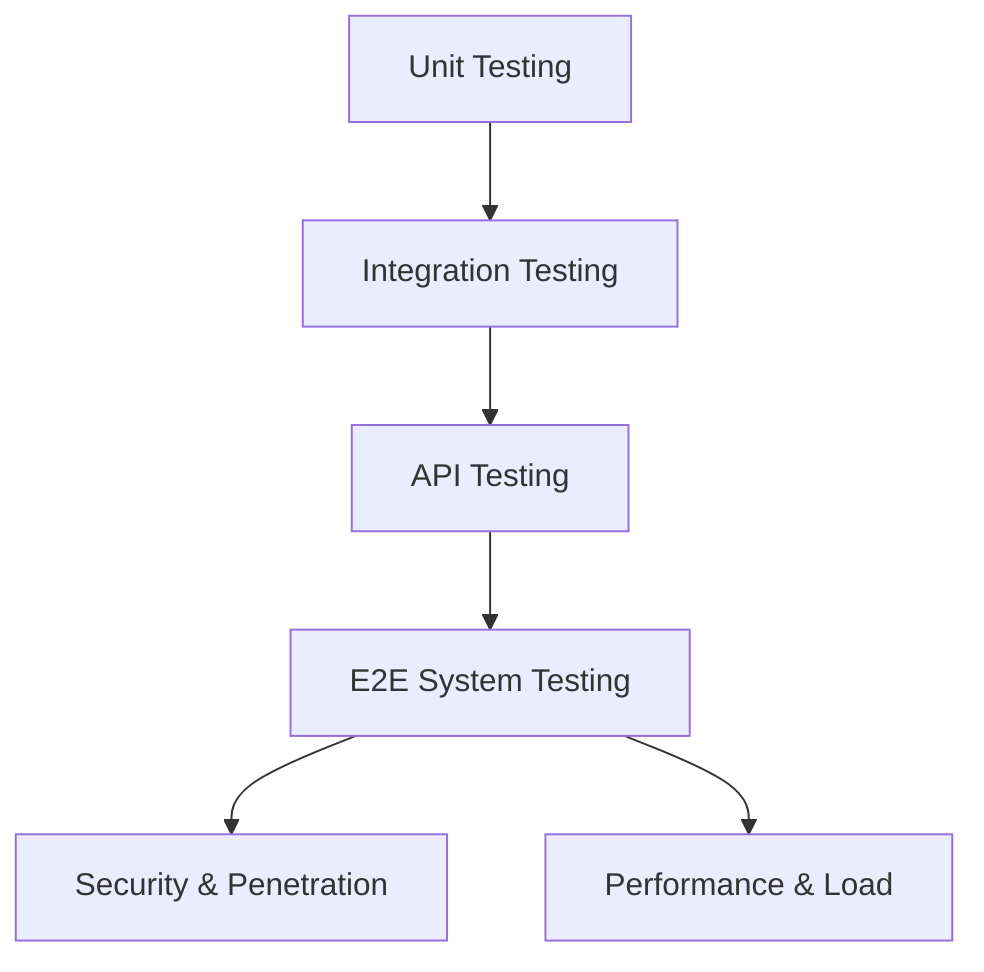

# StaySaga - Master Test Plan

## 1. Introduction & Objectives
This Master Test Plan defines the testing scope, strategy, environments, resources, and schedule for the **StaySaga** fullstack homestay/hotel booking application. StaySaga is a multi-role, highly concurrent platform inspired by Booking.com, demanding strict data consistency, strict security access controls, and a smooth user experience across mobile and desktop devices.

---

## 2. Scope & Target Audiences
The scope of testing covers the application components, server actions, APIs, database RLS policies, security protections, and page responsiveness across three system roles:

### 2.1 Guest (Customer)
- Account registration, credentials validation, and role assignment.
- Search engine queries (location, check-in/out dates, guest numbers, fuzzy match).
- Filtering (price range, amenities, reviews rating) and sorting (price high-to-low, low-to-high, top-rated).
- Homestay detail listings, images gallery, dynamic pricing schedules, and availability calendars.
- Checkout flow: guest contact info, cancellation policies acknowledgement, and payment integration.
- Booking management: order history, cancellation request, and refund processing.
- Rating & review posting after checkout dates.

### 2.2 Host (Partner)
- Onboarding and property listing creation wizard (category, location, photos, rooms, pricing, rules).
- Property edit, room inventory management, dynamic price schedule adjustments.
- Calendar availability management (marking custom dates as blocked/unblocked).
- Order administration: viewing and changing booking status (confirmed, rejected, completed, no-show).
- Financial metrics: viewing monthly/yearly revenue charts and listing performance statistics.
- Replying to guest ratings & reviews.

### 2.3 Admin (Administrator)
- User administration: list, search, and lock/unlock user accounts.
- Property approval panel: reviewing draft listings and approving/rejecting them.
- Booking monitoring: global orders table and order intervention tools.
- Content control: hide or remove spam reviews/comments.
- System analytics: global metrics (bookings count, total net revenue, active listings count).

---

## 3. Test Strategy & Levels

### 3.1 Unit Testing
- **Focus**: Validation of utility functions, price calculation algorithms, date/timezone diff calculations, and form validation schemes.
- **Tools**: Jest or Vitest.

### 3.2 Integration Testing
- **Focus**: Testing Supabase database constraints, RLS policies, and Server Actions (e.g., verifying that a draft cannot be read by another user).
- **Tools**: Node.js test scripts interacting with Supabase local docker instance.

### 3.3 API Testing
- **Focus**: Authentication headers (JWT validation), response codes (200, 201, 400, 401, 403, 404, 409), input sanitization, and database state compliance.
- **Tools**: Postman, Newman.

### 3.4 End-to-End (E2E) System Testing
- **Focus**: Simulating real user flows (Guest booking rooms, Host processing orders, Admin approving listings) across various browser viewports.
- **Tools**: Playwright.

### 3.5 Security Testing
- **Focus**: Testing vulnerabilities against OWASP Top 10 guidelines (SQL Injection, XSS, CSRF, IDOR, Mass Assignment, and Business Logic Abuse).
- **Tools**: OWASP ZAP, manual script verification.

### 3.6 Performance & Concurrency Testing
- **Focus**: Lighthouse scores, API response times under simulated loads, and concurrent booking isolation (verifying that no overlapping reservations can be confirmed for the same room).
- **Tools**: k6, Lighthouse.

---

## 4. Test Environments & Data
- **Staging/Local URL**: `http://localhost:3000`
- **Database**: local/remotely hosted Supabase PostgreSQL instance.
- **Mock Services**: Stripe payment integration webhooks, mocked SMTP mail server for notifications.
- **Test Data Seed Strategy**:
  - Seed 10 hosts with 3 properties each (various types: villa, apartment, room).
  - Seed 100 guest accounts.
  - Seed mock booking histories containing mixed statuses (`PENDING`, `CONFIRMED`, `CANCELLED`, `COMPLETED`).
  - Seed sample unread messages between guests and hosts to test notification indicators.

---

## 5. Pass/Fail Criteria
1. **Critical Functionality**: 100% of critical paths (auth, search, checkout, payment webhook, double-booking prevention) must pass.
2. **Security**: Zero high or medium severity vulnerabilities found (no SQL injection, no XSS, no broken access control).
3. **Compatibility**: UI layout must remain fully responsive and readable on viewports down to 320px width.
4. **Performance**: API response times for searching and listing details must remain under 1.5 seconds.
